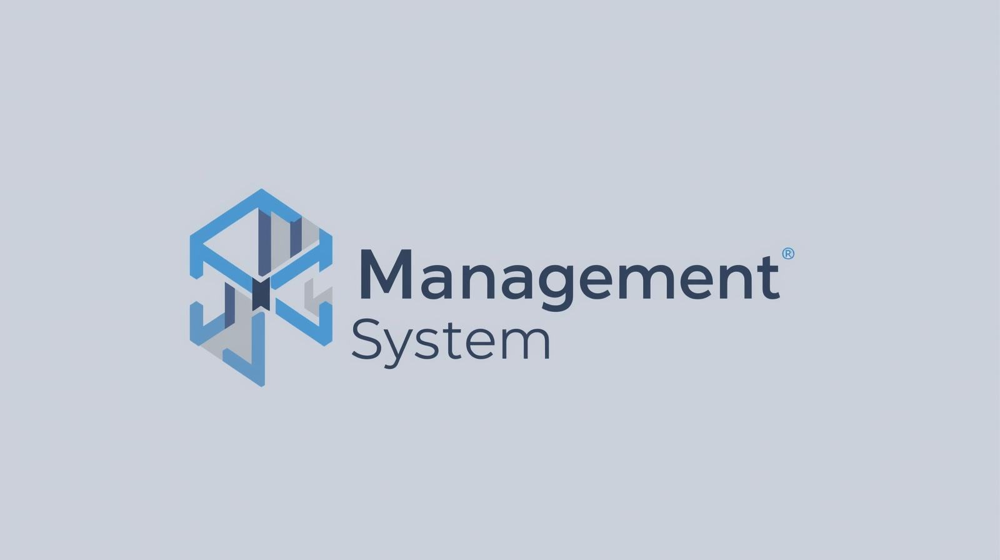
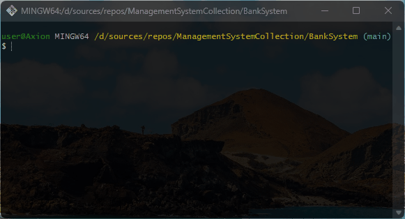

# 🔎 ManagementSystemCollection
A collection of object-oriented system simulations built with C#. Includes animal, transport, employee, and other management systems for practicing OOP concepts.

## 💻 About Program
*A repository that includes multiple systems. These systems performed various tasks, for example:*
1. *AnimalSystem - Working on animal information*
2. *TransportSystem - Working on transport information*
3. *EmployeeSystem - Work on office employee data*
4. *UniversityManagement - Control of the University System*
5. *Control over deposits and credit in the Banking System*

### 🪟 Preview

### ⚙️ Technologies
 

## 🧑‍💻 I worked on it
- *namespaces*
- *OOP princples: Encapsulation, Inheritance*
- *OOP possibilities: classes, objects methods, fields, properties*
- *Conversion: Parse*
- *Conditional statements: if else*
- *Strings: Interpolation, Regular*
- *Data types: int, decimal, string*

## 🤝 Future development
*Adding email and password attachments and organizing authentication and authorization for the BankSystem project*